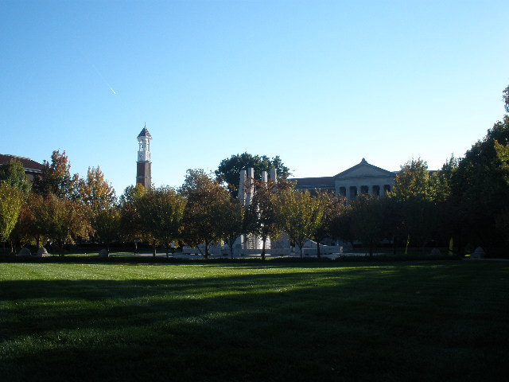
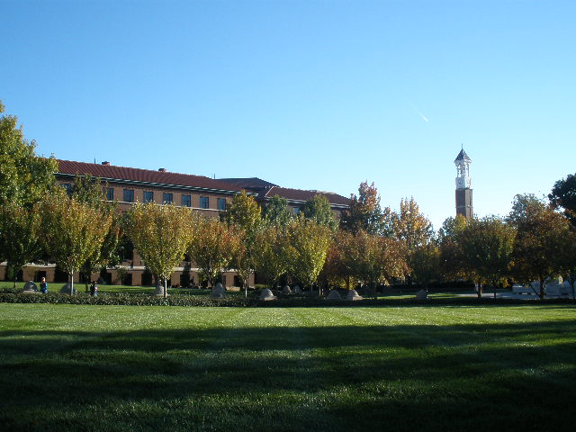
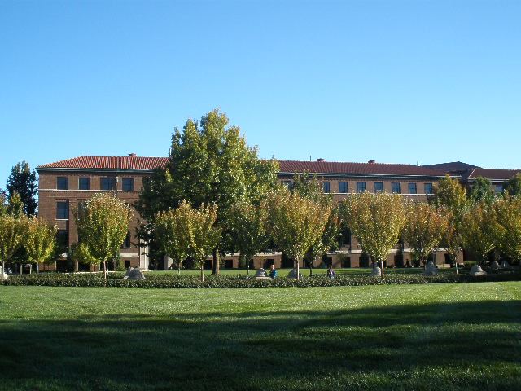
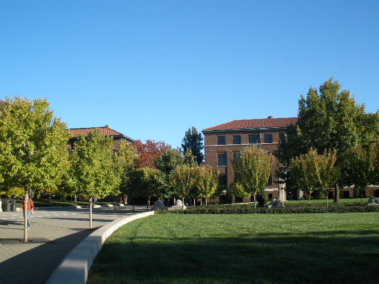

# Efficient Video Pipeline for Paper Corner Localization and Panoramic Image Synthesis

## Project Overview

This project focuses on two main objectives:

1. **Paper Corner Localization:** Design a robust video processing pipeline to detect and highlight the four corners of a paper in each frame of a video. The process uses several techniques, including edge detection, Hough Transform, and Harris corner detection, while ensuring the removal of blurry frames to improve accuracy.
  
2. **Panoramic Image Synthesis:** Develop a panoramic image synthesis pipeline to stitch overlapping images into a seamless panorama by extracting features, computing homographies, and combining multiple frames.

---

## Table of Contents
- [Project Overview](#project-overview)
- [Part 1: Paper Corner Detection and Blurry Frame Removal](#part-1-paper-corner-detection-and-blurry-frame-removal)
    - [Pipeline Description](#pipeline-description)
    - [Why These Methods?](#why-these-methods)
    - [Running the Code](#running-the-code)
    - [Video Demo](#video-demo)
- [Part 2: Panoramic Image Stitching](#part-2-panoramic-image-stitching)
    - [Pipeline Description](#pipeline-description-1)
    - [Why These Methods?](#why-these-methods-1)
    - [Images and Results](#images-and-results)
- [Dependencies](#dependencies)
- [Credits](#credits)

---

## Part 1: Paper Corner Detection and Blurry Frame Removal

### Pipeline Description
1. **Blurry Frame Detection:** Blurry frames are detected using the **Variance of Laplacian** method, which helps ensure that only sharp, well-defined frames are processed for accurate corner detection.
2. **Edge Detection:** The **Canny Edge Detection** algorithm is applied to detect paper edges in grayscale frames.
3. **Hough Line Transform:** The Hough Transform detects straight lines, which are used to identify the boundary edges of the paper.
4. **Corner Detection:** The **Harris Corner Detector** finds and highlights the four prominent corners of the paper.
5. **Overlay:** The detected edges and corners are overlaid onto the original frames, excluding any blurry frames.

### Why These Methods?
- **Variance of Laplacian** is an effective method for blurry image detection as it evaluates the sharpness of an image, ensuring only relevant frames are processed.
- **Canny Edge Detection** is a widely used, computationally efficient method for detecting edges, which is crucial for identifying the boundaries of the paper.
- **Hough Transform** allows precise detection of straight lines, making it ideal for finding the rectangular boundaries of a paper.
- **Harris Corner Detection** efficiently locates key corners, which helps in pinpointing the exact corners of the paper even in complex or noisy frames.

### Running the Code
1. Mount Google Drive and change the directory:
   ```python
   from google.colab import drive
   drive.mount('/content/drive/', force_remount=True)
   path_to_folder = "ENPM673/"
   %cd /content/drive/My\ Drive/{path_to_folder}

2. Run the pipeline to detect paper corners and filter out blurry frames:
   ```python
   input_vid = '/content/drive/MyDrive/ENPM673/Project-2/proj2_v2.mp4'
   output_vid = '/content/drive/MyDrive/ENPM673/Project-2/proj2_output.mp4'

###  Video Demo

You can watch the video demonstration of the corner edge detection process [here](https://youtube.com/shorts/pzc9_8Yhu7c?feature=share).

[](https://youtube.com/shorts/pzc9_8Yhu7c?feature=share)


---

## Part 2: Panoramic Image Stitching

### Pipeline Description
1. **Feature Extraction:** The **SIFT (Scale-Invariant Feature Transform)** algorithm is utilized to extract keypoints and descriptors from overlapping images. SIFT is robust against changes in scale and rotation, making it ideal for finding correspondences in images taken under varying conditions.

2. **Feature Matching:** The **BFMatcher (Brute Force Matcher)** method is employed to identify feature correspondences between consecutive images. This is followed by applying **RANSAC (Random Sample Consensus)** to filter out outliers and refine the matching process.

3. **Homography Calculation:** The computed matches are used to calculate the homographies between image pairs, which are essential for aligning the images correctly onto the same plane.

4. **Image Blending and Warping:** The aligned images are blended seamlessly using the computed homographies. This results in a panoramic image that combines multiple frames into a cohesive whole.

### Why These Methods?
- **SIFT** is an effective feature extraction method because it remains invariant to scaling and rotation, allowing for accurate feature matching in diverse images.
- **RANSAC** enhances the robustness of homography estimation by identifying and removing outliers from the feature matches, leading to better stitching accuracy.
- **Homographies** facilitate the alignment of images on the same plane, ensuring that the resulting panorama is seamless and visually appealing.

### Images and Results

Here are the input images used for panoramic stitching:

1. 
2. 
3. 
4. 

**Output Panorama:**


